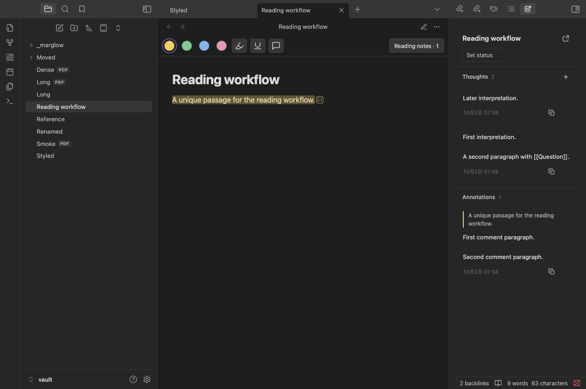
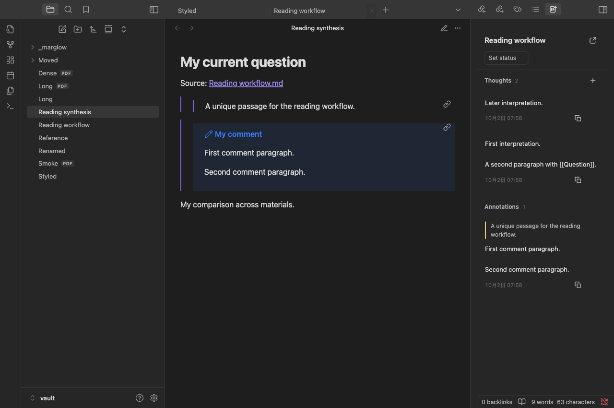
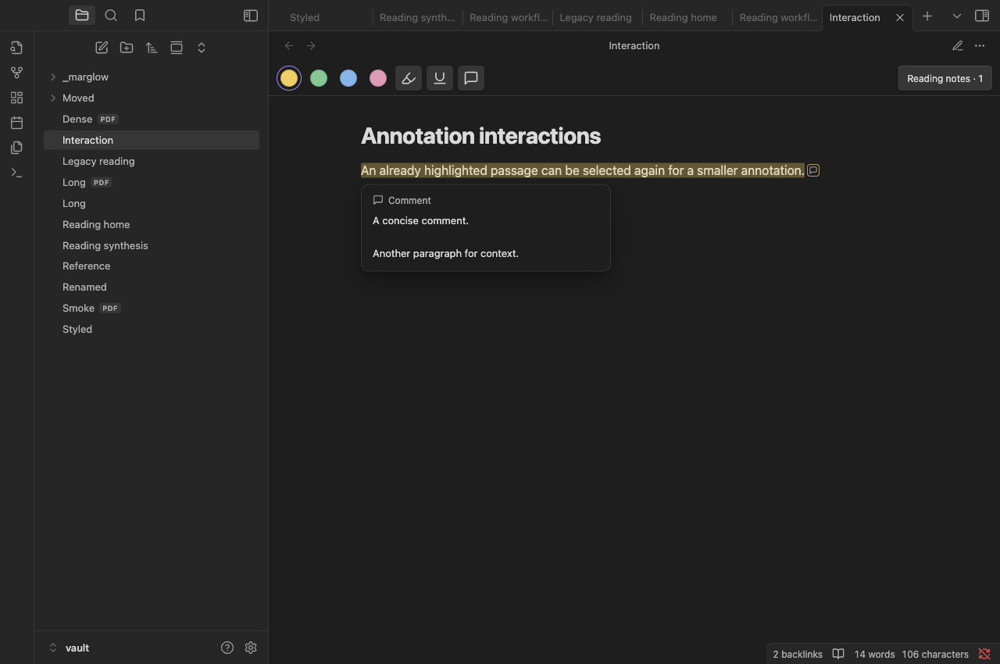

# Marglow


English · [简体中文](docs/README.zh-CN.md)

Highlight, underline, and comment on Markdown and PDFs without leaving your reading flow in Obsidian. Marglow keeps your annotations in editable Markdown reading notes while leaving source documents unchanged.

The name combines **margin** and **glow**.

## Status

**[0.3.0 public beta](https://github.com/Wp-Zhang/obsidian-marglow/releases/tag/0.3.0)** introduces the reading-note workflow described below. New behavior is checked in isolated Mac, mobile-emulation, and WebKit environments; physical iOS acceptance for 0.3.0 is pending. The earlier 0.2.5 build passed maintainer-reported physical iOS testing and Marglow has passed the Community Plugins review.

## Product direction

Record reactions while reading, revisit earlier thinking, and connect ideas across sources in ordinary Obsidian notes. Reading-note bodies stay editable, with anchor metadata at the end of the same file. Classification, summaries, reading status, and the reading home are optional.

## Features

- Background highlights and underlines in four colors, with optional comments.
- Markdown **Reading view**, including selections across formatting and paragraphs.
- Text-selectable PDFs, including selections across pages.
- A native Obsidian **Reading notes** sidebar with inline editing, timestamps, and navigation between annotations and their cards.
- Overlapping annotations, with distinct selected and hovered states.
- Draggable floating comment editors, small comment indicators, and read-only comment previews on mouse hover.
- Clear native text selection inside existing annotations, with PDF highlights sized to the actual text runs.
- Editable Markdown reading-note bodies, with metadata kept in a separate end section.
- Whole-material thoughts without selecting text; each new thought retains its own date and ID.
- Copy reference combines the source, quotation, and comment as native embeds for another note.
- Explicit note creation without annotations, optional reading status, and a reading home with native search or an optional Bases table.
- Previewed legacy-note upgrades with original backups and preserved quote IDs.
- Manual reassociation for annotations whose source text has moved or changed.
- Local storage, no network services, and compatibility with your existing Vault sync workflow.

## Screenshots

**Reading notes: revisit whole-material thoughts and passage comments together.**



**Synthesis: paste a reference into a question note and write your comparison around the linked quotation and comment.**



**Markdown: highlight, underline, and edit comments in the sidebar.**


**Comment preview: hover a commented mark to read its full comment without opening the editor.**



**PDF: read a paper with your annotations alongside it.** Shown with Vaswani et al., [Attention Is All You Need](https://arxiv.org/abs/1706.03762v5); the comments are demonstration reading notes.


## Installation

Requires **Obsidian 1.8.10 or later**. Mac and iOS are the target platforms. Physical iOS acceptance of the new build is pending; the optional Bases table requires Obsidian 1.9+ and its Bases core plugin.

### Published beta

1. Open **Settings → Community plugins → Browse**.
2. Search for **Marglow**, then select **Install** and **Enable**.

The same steps work on Mac and iOS. Existing users can update Marglow in Community plugins. Before upgrading a reading note to format 2, install Marglow 0.3.0 or later on every reading device.

### Manual installation or building from source

1. Download `marglow-0.3.0.zip` from the [release](https://github.com/Wp-Zhang/obsidian-marglow/releases/tag/0.3.0) and extract it. To build from source, run `npm ci` and `npm run package`; use `dist/marglow-0.3.0.zip` or `dist/marglow/`.
2. Copy `main.js`, `manifest.json`, and `styles.css` from the extracted `marglow/` folder into `<test-vault>/.obsidian/plugins/marglow/`.
3. Reload Obsidian and enable **Marglow** under **Settings → Community plugins**.

On iOS, transfer the same three files to your Vault’s plugin directory using your file manager or sync workflow, then enable Marglow on the device. Some sync tools do not transfer the hidden `.obsidian/` configuration folder automatically.

### BRAT

With [BRAT](https://github.com/TfTHacker/obsidian42-brat), add `Wp-Zhang/obsidian-marglow` or select `0.3.0` explicitly.

Start in a test Vault. Report problems through [GitHub Issues](https://github.com/Wp-Zhang/obsidian-marglow/issues/new/choose), including app/plugin versions, device, reproduction steps, and a sample with private content removed.

## Use

1. Open a Markdown note in **Reading view** or a PDF with selectable text.
2. Select text and choose a color for a highlight, or use the Underline or Comment tool. You can also activate a toolbar tool before selecting text; click the active tool again to turn it off.
3. Write a comment and save, or click/tap outside to save automatically. Cancel discards the current unsaved edit. On Mac, use `Cmd + Enter` to save and `Esc` to cancel.
4. Click an existing annotation to select it. With the sidebar hidden, its floating tools let you edit it. With the sidebar visible, its matching card is selected and scrolled into view without a popup. The page toolbar changes the selected annotation's color or switches between highlight and underline in either mode, keeping its IDs and comment. Choose overlapping entries in the sidebar, or in the floating picker when the sidebar is hidden.
5. Click **Reading notes** (an icon with a count on mobile) to toggle the native **Reading notes** sidebar. Clicking annotations does not open it automatically. Click a sidebar quote to jump to the source, or comment text to edit in place.

Delete a selected annotation with `Delete`, `Backspace`, or Mac `Cmd + Delete`, or use its trash icon. Deleting an annotation removes both its mark and comment; clearing only the comment keeps the mark. Text inputs retain normal editing shortcuts. Unsaved comments remain available if saving fails.

Drag a floating comment editor by its **Comment** heading; a focused heading also responds to arrow keys. Moving it keeps the current draft, and resizing the viewport keeps it reachable. Inline sidebar editors stay within their cards. A small comment icon identifies annotated passages with comments; mouse hover opens a simple read-only preview without entering the editor. Selecting source text temporarily hides annotation paint so the native selection remains clear.

Changing color or style inside the floating window saves that appearance change and keeps the window open in place. The comment draft remains unsaved until Save or outside-click autosave; Cancel discards only that unsaved text. Repeated changes retain the same annotation and references.

The sidebar keeps the material title, an **Open complete note** icon, and a compact status control at the top. **Thoughts** has a plus icon for adding a thought. Saved records place time, **Copy reference**, and delete icons in a small footer; the buttons provide hover hints and accessible labels. The empty Thoughts section has no explanatory placeholder.

Cards without comments place an **Add comment** icon beside copy and delete in the bottom-right footer, with no extra text row. Annotation action icons appear together on card hover or keyboard focus; touch layouts keep them available. If the same selection already has an annotation of the target style, switching styles preserves both records and asks you to select the existing one.

Use **Add thought** in Reading notes, or **Marglow: Add whole-material thought**, to write about the whole material without selecting a passage. Saving appends a dated record; editing an existing thought changes that record. The Save/Cancel and outside-click rules match comments. Reading status changes only when you explicitly choose it.

Use **Copy reference** on a saved card, or its editor context-menu action, and paste into an ordinary question note. Quotations and multi-paragraph comments remain linked to their reading note; later changes update the embeds. Plain-text snapshots and batch copying are not provided.

Annotations that cannot be located remain in the sidebar. Use **Reassociate an annotation** to attach one to replacement text; Marglow does not guess ambiguous locations.

## Reading notes and synchronization

A reading note is created when you first save an annotation or thought, explicitly create a note, or set reading status. Opening a source or its sidebar does not create or rewrite a note. New notes live in the source directory’s ordinary `_marglow/` subfolder:

```text
article.md
paper.pdf
_marglow/
  article.md.annotations.md
  paper.pdf.annotations.md
```

Keep one reading note per source. Existing companion paths remain supported. Source files are never rewritten, and notes remain available when a source disappears.

In format 2, use **Open complete note** to edit quotations, comment callouts, thoughts, and free writing in Obsidian's native editor. The body contains ordinary Markdown blocks and stable IDs; system data stays at the end. Keep block IDs and system data intact. Clearing a comment keeps its empty callout and ID, preserving the highlight and earlier references. Use the delete controls to remove an entire record atomically.

If readable blocks are removed while metadata remains, the note is incomplete. Marglow pauses unsafe writes; **Review missing reading records** lets you explicitly remove the remnants, or open the note to repair it. Metadata cannot recover a lost comment. Conflict markers, duplicate IDs, unknown formats, and malformed data also pause unsafe writes without overwriting the file.

Legacy format 1 remains readable and editable with its original rules. Use **Upgrade reading note format** to preview the conversion and save a verified `<note>.v1.bak` backup. It preserves document/annotation IDs, quote block IDs, comments, and handwritten content. Opening an old note never upgrades it. Before using format 2, update Marglow on every reading device: older builds cannot write it reliably, especially if its note has been moved. A backup represents the pre-upgrade file and excludes later edits; preserve your current note before restoring it.

**Copy reference** uses actual saved IDs. Existing quote links keep pointing to the quotation; new comment IDs reference the entire comment callout. Adding a comment later does not automatically add a second embed to an already pasted quote-only reference. Ordinary block links reach the reading note; Marglow's navigation returns to the exact source selection.

Optionally set `marglow_title` in the note's properties for a display title. **Create reading home** writes a normal Markdown note at a path you choose, without overwriting existing files. Its optional Bases table offers All/Reading/Read views; native search works without Bases. Modified times describe file edits, not reading dates.

Reading notes are the only persistent annotation store. Your existing sync tool owns transport and cross-device conflicts; Marglow provides no synchronization or version-selection subsystem.

### Commands

All command names have the `Marglow:` prefix in the command palette.

| Command | Purpose |
| --- | --- |
| Open comments sidebar | Open the native reading-note sidebar |
| Create reading note | Explicitly create or reuse a companion note |
| Add whole-material thought | Append a thought without selecting source text |
| Upgrade reading note format | Preview conversion and keep a verified original backup |
| Review missing reading records | Review and explicitly remove incomplete records |
| Create reading home | Create a Markdown entry point with optional Bases views |
| Open reading notes | Open the current source’s companion Markdown note |
| Open source document | Open the source linked to the current reading note |
| Reassociate an annotation | Choose an entry, select replacement text, then press Reassociate |
| Cancel reassociation | Cancel the pending replacement selection |
| Relink reading notes to a source document | Choose a replacement source of the same type from a reading note |

## Limitations

- Source highlighting is supported in Markdown Reading view; source editing views and scanned PDFs without a text layer are outside scope. Companion reading-note editing is supported.
- Windows has not been verified for this beta.
- Annotations stay in reading notes; they are not embedded into PDFs or source Markdown.
- PDF integration depends on Obsidian’s viewer internals, so host updates may require compatibility fixes.
- Reference copying is supported; plain-text quote snapshots and custom copy templates remain later work.
- New mobile input, clipboard, and upgrade interactions still need physical iOS acceptance.

## Development

Building requires Node.js 22 or later and the system `zip` command. Node.js is not required to run the plugin.

```sh
npm ci
npm run check        # Type checking, lint, and tests
npm run package      # Installable files in dist/marglow/
```

Install the contents of `dist/marglow/` in a dedicated test Vault using the manual installation steps above. `npm run dev` watches and rebuilds during development.

Numeric version tags trigger GitHub Actions to build, attest, and publish release files. ZIP downloads are for manual installation; Obsidian downloads the three plugin files.

For host integration checks, use `npm run smoke:mac`, `npm run smoke:mobile`, and `npm run smoke:webkit`. See [testing instructions and the device checklist](docs/TESTING.md) for setup and recorded verification, and [AGENTS.md](AGENTS.md) for development principles.

## License

[MIT](LICENSE).
