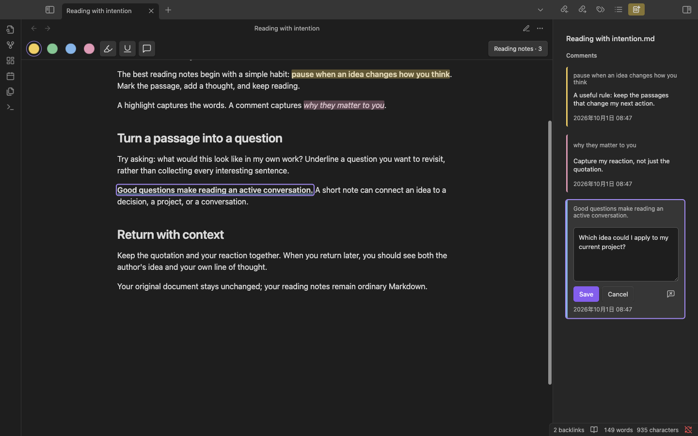
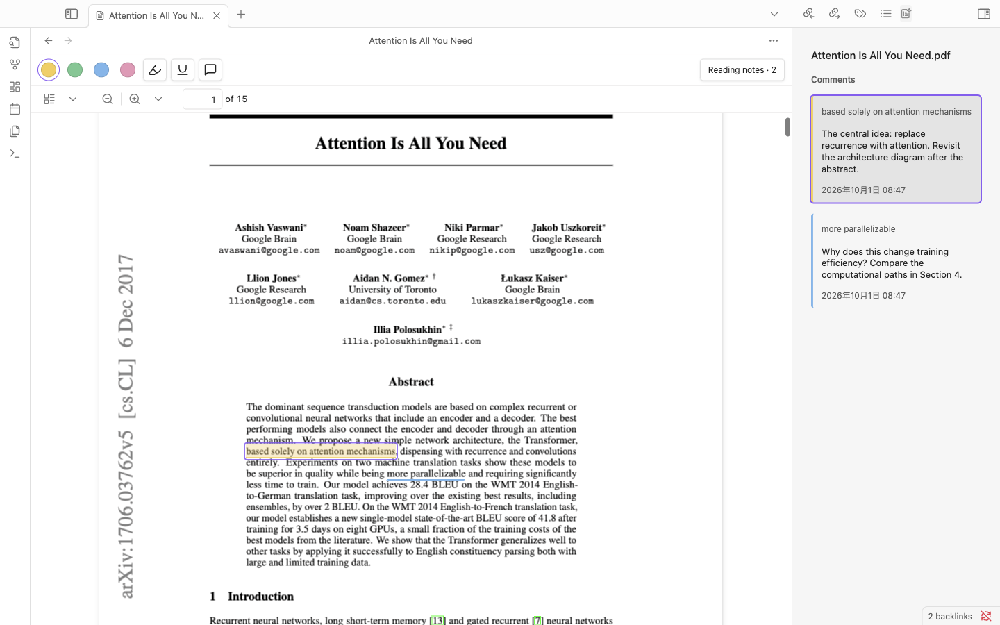

# Marglow


[English](../README.md) · 简体中文

在 Obsidian 中为 Markdown 和 PDF 添加高亮、下划线与评论，保持阅读连贯。Marglow 将标注保存为可编辑的 Markdown 阅读笔记，源文件保持不变。

名称来自 **margin**（页边批注）与 **glow**（高亮）。

## 当前状态

**0.2.3 是 public beta**，可从 [GitHub Releases](https://github.com/Wp-Zhang/obsidian-marglow/releases/tag/0.2.3) 安装。已通过 Mac 和 iOS 真机测试。尚未上架 Obsidian 社区插件目录。

## 功能

- 四种颜色的背景高亮和下划线，可附加评论。
- 支持 Markdown **阅读视图**，选区可跨越格式元素和段落。
- 支持具有可选文本层的 PDF，包括跨页选区。
- Obsidian 原生 **Comments** 侧栏，支持原位编辑、时间显示及正文与卡片双向跳转。
- 支持重叠标注，并区分选中与悬停状态。
- 可编辑的 Markdown 阅读笔记，摘录支持普通 Obsidian 块引用。
- 原文移动或变化后，可手动重新关联标注。
- 本地存储，无网络服务，配合你已有的 Vault 同步方式使用。

## 界面展示

**Markdown：高亮、下划线，并直接在侧栏编辑评论。**



**PDF：阅读论文，在侧栏查看对应标注。** 示例使用 Vaswani 等人的 [Attention Is All You Need](https://arxiv.org/abs/1706.03762v5)，评论为演示阅读笔记。



## 安装

需要 **Obsidian 1.8.10 或以上**。本 beta 支持 Mac 和 iOS。

### 手动安装

1. 从 [发布页](https://github.com/Wp-Zhang/obsidian-marglow/releases/tag/0.2.3) 下载并解压 `marglow-0.2.3.zip`。
2. 将解压后的 `marglow/` 中的 `main.js`、`manifest.json` 和 `styles.css` 放入 `<vault>/.obsidian/plugins/marglow/`。
3. 重载 Obsidian，在“设置 → 第三方插件”中启用 **Marglow**。

iOS 使用相同的三个文件，通过文件管理或同步方式放入 Vault 的插件目录，再在设备上启用 Marglow。部分同步工具不会自动传输隐藏的 `.obsidian/` 配置目录。

### BRAT

使用 [BRAT](https://github.com/TfTHacker/obsidian42-brat) 时，添加仓库 `Wp-Zhang/obsidian-marglow`，允许预发布版本，或明确选择 `0.2.3`。

首次体验请使用测试 Vault。发现问题请在 [GitHub Issues](https://github.com/Wp-Zhang/obsidian-marglow/issues/new/choose) 提供应用及插件版本、设备、复现步骤和去除隐私信息的示例。

## 使用方式

1. 在**阅读视图**打开 Markdown，或打开文字可选的 PDF。
2. 选择文本后点击颜色添加高亮，或使用下划线、评论工具。也可以先开启工具栏中的工具再选择文本；再次点击已开启的工具即可关闭。
3. 输入评论并保存，或点击／轻触外部自动保存。取消会放弃本次未保存修改。Mac 支持 `Cmd + Enter` 保存、`Esc` 取消。
4. 点击标注可修改颜色、编辑评论或删除。重叠区域会提供条目选择列表。
5. 点击 **Reading notes**（移动端为图标加数量）展开原生 **Comments** 侧栏。点击引用跳转到正文标注，直接点击评论文字在卡片内编辑；点击正文标注也会定位对应卡片。

选中的标注可用 `Delete`、`Backspace`、Mac `Cmd + Delete` 或垃圾桶图标删除。删除标注会同时移除标记和评论；仅清空评论会保留标记。输入框中的快捷键仍按正常文字编辑处理。保存失败时保留未保存的评论。

无法定位的标注仍会显示在侧栏。使用 **Reassociate an annotation** 将其关联到替代文本；位置有歧义时不会自动猜测。

## 阅读笔记与同步

首条标注保存后才创建阅读笔记。新笔记存放在源目录的普通 `_marglow/` 子目录中：

```text
article.md
paper.pdf
_marglow/
  article.md.annotations.md
  paper.pdf.annotations.md
```

已有伴随笔记仍可在原位置使用。每份材料只保留一份阅读笔记。

使用 **Marglow: Open reading notes** 直接编辑 Markdown 文件。可以在评论边界内编辑，在标注条目外添加自己的笔记；请保持生成的元数据和 ID 不变。手动删除时，应删除从 `oa:annotation:start` 到对应 `oa:annotation:end` 的整个条目。

保存的摘录支持普通 Obsidian 块引用：

```markdown
[[folder/_marglow/article.md.annotations#^ann-<saved-id>]]
```

请用阅读笔记中的实际块 ID 替换占位内容。编辑及重新关联保留 ID；删除标注会移除引用目标。

阅读笔记是唯一持久化标注数据源。Marglow 不改写源 Markdown 或 PDF，文件传输与跨设备冲突由你的同步工具处理。如果阅读笔记含有冲突标记、重复 ID 或损坏的元数据，插件会暂停不安全写入，直到文件修复。无关笔记和手写内容会被保留。

### 命令

命令面板中的以下命令均带有 `Marglow:` 前缀，插件界面目前使用英文。

| 命令 | 用途 |
| --- | --- |
| Open comments sidebar | 打开原生评论标签页 |
| Open reading notes | 打开当前材料的伴随 Markdown 阅读笔记 |
| Open source document | 打开当前阅读笔记关联的源文件 |
| Reassociate an annotation | 选择条目，重新选择替代文本，再点击 Reassociate |
| Cancel reassociation | 取消待完成的重新关联 |
| Relink reading notes to a source document | 从阅读笔记中选择同类型的替代源文件 |

## 限制

- 不支持 Markdown 编辑视图，以及没有文本层的扫描 PDF。
- 本 beta 尚未验证 Windows。
- 标注保存在阅读笔记中，不嵌入 PDF 或源 Markdown。
- PDF 集成依赖 Obsidian 查看器内部接口，宿主更新后可能需要适配。
- 尚未提供专用 Copy link／Copy quote 操作，可使用阅读笔记中的块引用。

## 开发

构建需要 Node.js 22 或以上和系统 `zip` 命令，运行插件不需要 Node.js。

```sh
npm ci
npm run check        # 类型检查、lint 与测试
npm run package      # 生成 dist/marglow/ 中的可安装文件
```

按照上述手动安装步骤，将 `dist/marglow/` 中的文件安装到独立测试 Vault。开发时可用 `npm run dev` 监听变化并重建。

宿主集成检查使用 `npm run smoke:mac`、`npm run smoke:mobile` 和 `npm run smoke:webkit`。环境配置、验证记录及设备清单见 [测试说明](TESTING.md)，开发原则见 [AGENTS.md](../AGENTS.md)。

## 许可证

[MIT](../LICENSE)。
